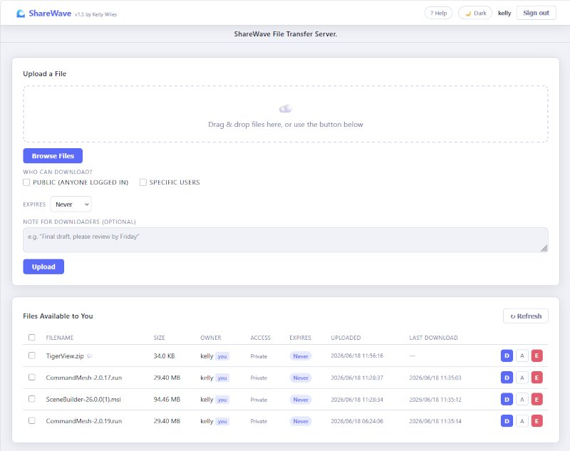
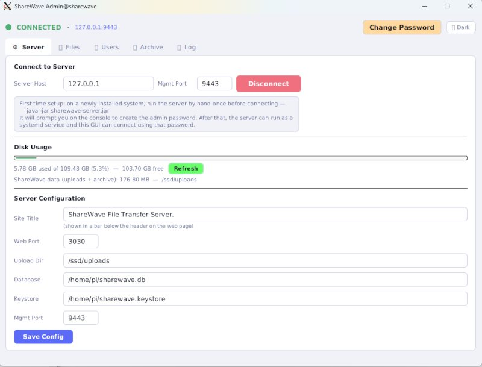

# 🌊 ShareWave

A self-hosted file sharing server consisting of two separate components:

- **`sharewave-server`** — headless Jetty HTTPS server; runs as a systemd
  service in the background with no display required.
- **`sharewave-gui`** — JavaFX admin panel; connects to the server over TCP
  from the same machine or remotely, manages users, files, archive, and config.

Web users access ShareWave through any browser at the server's HTTPS address.

> **Just want to get it running?** See [INSTALL.md](INSTALL.md) for a
> straight-through install guide. This README covers everything else —
> configuration, architecture, troubleshooting, and reference details.

---

## Architecture

```
┌────────────────────────────────────────────────────┐
│  sharewave-server  (headless, systemd service)     │
│                                                    │
│  ┌───────────────────┐  ┌─────────────────────────┐│
│  │  Jetty HTTPS      │  │  Management TCP         ││
│  │  port 8443        │  │  port 9443              ││
│  │  (web users)      │  │  JSON protocol          ││
│  └───────────────────┘  └─────────────────────────┘│
└────────────────────────────────────────────────────┘
                          ▲ TCP 9443
┌────────────────────────────────────────────────────┐
│  sharewave-gui  (JavaFX, any machine)              │
│  Connect → Authenticate → Manage                   │
└────────────────────────────────────────────────────┘
```

---

## Features

| Category | Details |
|---|---|
| **Transport** | HTTPS via Jetty 11, self-signed cert auto-generated by `keytool` |
| **Auth** | bcrypt-hashed passwords; 30-min session tokens |
| **Upload** | Drag-and-drop or file picker, multiple files at once; per-file progress; duplicate replace prompt |
| **Access control** | Public or specific users per file, managed from web UI and GUI |
| **Expiry** | 1 / 3 / 7 / 14 / 30 / 90 / 365 days or never; auto-archived on expiry |
| **Per-user storage** | Each account's uploads live in their own subdirectory under `uploads/` |
| **Download tracking** | Last-download timestamp shown per file (web UI and GUI) |
| **Bulk download** | Select multiple files in the web UI and download them as one `.zip` or `.tar.gz` |
| **Uploader notes** | Optional note attached to each file, visible to downloaders; editable later (web UI and GUI) |
| **Archive** | Expired files moved to `uploads/archive/`, managed by admin |
| **Logging** | Rotating log files (1 MB / 2 backups) in `uploads/logs/`; full log + live stream in GUI |
| **Disk usage** | GUI shows filesystem space used/free and ShareWave's own storage footprint |
| **Theme** | Dark / light theme in both the GUI and the web UI |
| **Headless server** | Runs as a systemd service, no display needed |
| **Remote GUI** | GUI connects over TCP — can be on a different machine |

---

## Screenshots

**Web UI** — drag-and-drop upload, optional note for downloaders, access control, and bulk-select for multi-file download:



**Admin GUI — Server tab** — connection status, disk usage, and server configuration:



---

## Requirements

| Tool | Version | Needed for |
|---|---|---|
| Java JDK | 17+ (21 recommended) | Both modules |
| Maven | 3.8+ | Building from source |

---

## Quick start — build and install

```bash
git clone <repo-url>
cd sharewave

# Build both JARs (downloads JavaFX into ~/.m2 for the GUI)
./build.sh

# Install both to /opt/sharewave, set up the systemd service, and
# install the "sharewave" command for the GUI
sudo ./install.sh
```

`install.sh` copies the built JARs and JavaFX native libraries to
`/opt/sharewave/`, installs `sharewave-server.service`, and enables/starts
the server. It also creates `/opt/sharewave/sharewave` (a wrapper that
launches the admin GUI) and links it to `/usr/local/bin/sharewave`.

> **Run `./build.sh` as your normal user, not root** — Maven downloads
> JavaFX into *your* `~/.m2`, which `install.sh` then copies from. If you
> only build as root, `sudo` won't find them; `install.sh` checks both
> `$SUDO_USER`'s home and `$HOME` to handle the common case of building as
> yourself and installing with `sudo`.

### First run — set the admin password

```bash
sudo systemctl stop sharewave-server
java -jar /opt/sharewave/sharewave-server.jar   # enter password, then Ctrl+C
sudo systemctl start sharewave-server
```

### Running the admin GUI

```bash
sharewave
```

This works from any directory once `install.sh` has run. The GUI can also
be installed on a **different machine** than the server — see "Installing
the GUI on another machine" below.

### Re-installing / updating

`./build.sh && sudo ./install.sh` is safe to re-run any time — it rebuilds
the JARs, overwrites the previous install, and restarts the service if it
was already running.

### Running the server without installing

```bash
java -jar sharewave-server/target/sharewave-server.jar
```

On first run the server prompts for an admin password on the console, then
starts listening. Press **Ctrl+C** to stop.

### Editing the systemd service

If your username is not `pi`, edit `sharewave-server.service` *before*
running `install.sh` (or edit `/etc/systemd/system/sharewave-server.service`
afterward and run `sudo systemctl daemon-reload`):

```bash
nano sharewave-server.service   # change User=pi / Group=pi to your username
```

### Checking the server is running

```bash
systemctl status sharewave-server
journalctl -u sharewave-server -f   # live log tail
```

---

## Versioning

There is exactly **one** `VERSION` file, at the project root — both
`sharewave-server` and `sharewave-gui` read it directly at runtime
(nothing is copied or bundled into either JAR). It's what's shown in the
web UI header ("v1.0 by Kelly Wiles") and the admin GUI's title bar.

**To change the version:**

Run `./build.sh` — it prompts for a version number (showing the current
one as the default; press Enter to keep it) and writes it to `VERSION`
before building. Then `sudo ./install.sh` to copy the updated `VERSION`
to `/opt/sharewave/VERSION` alongside the JARs.

The prompt is skipped automatically in non-interactive contexts (CI,
piped input, etc.) — the existing `VERSION` is left as-is and the build
proceeds without blocking. You can also edit `VERSION` directly at any
time instead of using the prompt.

No rebuild is required for a version-only change on an already-installed
system — `AppVersion` reads `VERSION` fresh from disk each time the JAR
starts, so editing `/opt/sharewave/VERSION` and restarting the
server/GUI is enough.

**Running from source without installing:** `AppVersion` also checks two
directories above the running JAR (e.g.
`sharewave-server/target/sharewave-server.jar` → `../../VERSION`), so
`java -jar sharewave-server/target/sharewave-server.jar` run straight
from a source checkout finds the project root's `VERSION` automatically.

If no `VERSION` file is found in either location, the version displays
as `dev`.

---

## Installing the GUI on another machine

The GUI can run on **any machine** that can reach the server's management
port (default **9443**) over TCP — it doesn't need to be on the same
machine as the server.

Copy the repo (or just `sharewave-gui/`, `build.sh`, `install.sh`,
`sharewave-server.service`) to that machine, then:

```bash
./build.sh gui
sudo ./install.sh
```

`install.sh` will still try to install/start `sharewave-server.service` —
that's fine even if you don't run the server here, but if `sharewave-server.jar`
hasn't been built (`./build.sh gui` only builds the GUI), the service will
fail to start. Either run `./build.sh` (both modules) or ignore the service
failure and just use `sharewave` for the GUI.

Alternatively, run the GUI directly without installing, using the provided
wrapper which finds JavaFX in `~/.m2` automatically:

```bash
chmod +x run-gui.sh
./run-gui.sh
```

> **Note:** `java -jar sharewave-gui.jar` alone will fail with
> *"JavaFX runtime components are missing"* because the fat JAR contains
> the JavaFX classes but not the platform native libraries. Use
> `run-gui.sh`, or `sharewave` after running `install.sh`.

---

## First launch — GUI

1. A **Set Admin Password** dialog appears on very first run.  
   Choose a password (min 4 characters). Stored as a bcrypt hash in
   `~/.sharewave-admin.conf`.

2. The main window opens. In the **⚙ Server** tab enter:

   | Field | Default | Description |
   |---|---|---|
   | Server Host | `127.0.0.1` | IP or hostname of the machine running the server |
   | Mgmt Port | `9443` | Management TCP port (must match server config) |

3. Click **Connect**. A password prompt appears — enter the same admin password.

4. Once connected, the status bar turns green and all tabs become active.

The last-used host and port are saved to `~/.sharewave-gui.conf` and
restored automatically next time.

---

## First launch — server (console / systemd)

On first start the server checks for `~/.sharewave-admin.conf`.  
If it does not exist it prompts for a new password on **stdout**:

```
[ShareWave] No admin password set.
[ShareWave] Enter new admin password: ▌
```

Type a password and press Enter. The hash is written to
`~/.sharewave-admin.conf` and the server continues starting up.

When running as a systemd service (no terminal), set the password **before**
enabling the service by running the JAR manually once (see Option B above).

---

## Server configuration

Settings are saved to `~/.sharewave.conf` and can be edited from the GUI's
**⚙ Server** tab while connected.

| Setting | Default | Description |
|---|---|---|
| Web Port | `8443` | HTTPS port for browser users |
| Mgmt Port | `9443` | TCP port the GUI connects to |
| Upload Dir | `~/sharewave-uploads` | Root directory for uploaded files |
| Database | `~/sharewave.db` | SQLite database file |
| Keystore | `~/sharewave.keystore` | PKCS12 TLS keystore |
| Session Timeout | `5` minutes | How long a web UI session stays signed in with no activity |

> **Note:** Config changes made via the GUI take effect on the **next server
> restart**. The server must be restarted via systemd or by stopping and
> re-running the JAR.

### Setting up the uploads directory

The upload directory and all of its subdirectories are created
**automatically** — there's nothing you need to create by hand for the
default setup to work. The first time the server starts, it creates the
upload root (default `~/sharewave-uploads`); the first time each user
uploads a file, it creates that user's own subdirectory underneath it
(`~/sharewave-uploads/<username>/`).

**Using the default location:** nothing to do — just start the server.

**Using a custom location** (e.g. a larger disk or external drive mounted
at `/mnt/storage`):

1. Set **Upload Dir** in the GUI's **⚙ Server** tab (or edit `upload_dir`
   directly in `~/.sharewave.conf`) to the path you want, e.g.
   `/mnt/storage/sharewave-uploads`.
2. Make sure the directory's *parent* exists and is writable by whichever
   user runs the server:
   ```bash
   sudo mkdir -p /mnt/storage/sharewave-uploads
   sudo chown pi:pi /mnt/storage/sharewave-uploads   # match User=/Group= in sharewave-server.service
   ```
   The server will create the directory itself if it doesn't exist, but it
   needs write permission on the parent to do so.
3. Restart the server (`sudo systemctl restart sharewave-server`, or
   stop/re-run the JAR) for the change to take effect.

> **Running as a systemd service?** The service's `User=`/`Group=` (default
> `pi`) must have write access to the upload directory. If you change the
> upload path to somewhere outside that user's home directory (e.g. a
> separate mounted disk, as above), double-check ownership/permissions —
> this is the most common cause of "Internal server error" on upload after
> changing the path.

**Disk space:** there's no built-in storage quota — plan for enough free
space on whichever disk holds the upload directory. Use the GUI's **⚙
Server** tab "Disk Usage" panel to monitor usage at any time, including
how much of the total is taken up by ShareWave's own files specifically.

**Per-user layout:** each user gets their own subdirectory, named after
their username with any character outside `a-zA-Z0-9._-` replaced with
`_` (see "Directory layout" below for the full structure).

---

## Firewall / router — exposing ShareWave to the internet

| Port | Purpose | Who needs access |
|---|---|---|
| **8443** | HTTPS web UI | Browser users (internet or LAN) |
| **9443** | GUI management | Admin only — do **not** open to the internet |

To let people outside your home network reach ShareWave, you need to forward
port **8443** from your router to the Pi (or other host) running the server.
Port **9443** must stay closed to the internet — see the SSH tunnel section
below if you need remote admin access.

### Step 1 — Find the server's local IP address

On the machine running `sharewave-server`:

```bash
hostname -I
# example output: 192.168.1.50
```

Note this address — you'll enter it as the "internal" or "destination" IP
when setting up port forwarding.

### Step 2 — Give the server a static local IP (recommended)

Routers can reassign local IP addresses over time (DHCP), which would break
your port-forward rule. Either:

- Set a **DHCP reservation** in your router (binds the Pi's MAC address to a
  fixed IP — look for "DHCP Reservation," "Static Lease," or "Address
  Reservation" in your router's settings), or
- Configure a static IP directly on the Pi via `/etc/dhcpcd.conf` or your
  distro's network manager.

### Step 3 — Log in to your router's admin page

This is usually `http://192.168.1.1` or `http://192.168.0.1` in a browser
(check the sticker on the router, or run `ip route | grep default` on the
Pi to find the gateway address). Log in with the router's admin credentials
(often on a label on the router itself).

### Step 4 — Create a port forwarding rule

Look for a section called **Port Forwarding**, **Virtual Server**, **NAT
Forwarding**, or **Applications & Gaming** — naming varies by manufacturer.
Create a new rule:

| Field | Value |
|---|---|
| Service name | `ShareWave` (any label) |
| External / WAN port | `8443` |
| Internal / LAN port | `8443` |
| Internal IP address | the Pi's local IP from Step 1 (e.g. `192.168.1.50`) |
| Protocol | `TCP` |

Save and apply. Some routers require a reboot for the rule to take effect.

> **Do not** create a rule for port 9443. It should remain unreachable from
> outside your network.

### Step 5 — Find your public IP address

From any device on your network:

```bash
curl ifconfig.me
```

or visit [whatismyip.com](https://whatismyip.com) in a browser. This is the
address people outside your network will use to reach ShareWave:

```
https://<your-public-ip>:8443/
```

### Step 6 — Handle dynamic public IPs (most home connections)

Most ISPs assign a public IP that changes periodically. If yours does,
either:

- Check whether your router supports **Dynamic DNS (DDNS)** — services like
  DuckDNS, No-IP, or your router manufacturer's own DDNS give you a
  permanent hostname (e.g. `myhouse.duckdns.org`) that automatically updates
  when your IP changes, or
- Manually re-check your public IP if it changes (rare on many home
  connections, but possible).

### Step 7 — Test from outside your network

Disconnect a phone from Wi-Fi (use cellular data) and visit:

```
https://<your-public-ip-or-ddns-hostname>:8443/
```

You'll see the self-signed certificate warning — click through it (see
"Self-signed certificate" below) and you should reach the ShareWave login
page.

### Operating system firewall (ufw / firewalld)

If the Pi itself runs a firewall, allow the web port locally too:

```bash
# ufw (Debian/Raspberry Pi OS)
sudo ufw allow 8443/tcp

# firewalld (Fedora/RHEL-based)
sudo firewall-cmd --permanent --add-port=8443/tcp
sudo firewall-cmd --reload
```

Do **not** open 9443 in the OS firewall either, beyond what's needed for the
GUI to connect from your local network.

### Remote admin access via SSH tunnel

Since port 9443 stays closed to the internet, manage the server remotely by
tunneling through SSH instead:

```bash
ssh -L 9443:127.0.0.1:9443 pi@your-server-ip
# Then connect the GUI to 127.0.0.1:9443
```

This requires SSH (port 22) to be reachable — either on your local network,
or forwarded through the router using the same steps above (with its own,
separate risks; consider key-based auth and disabling password login if you
do this).

### Security notes

- ShareWave uses a self-signed TLS certificate by default — traffic is
  encrypted, but browsers will warn on first visit (see below for using a
  real certificate).
- Anyone with the public URL and valid web credentials can upload/download
  files according to the access rules you set. Use strong passwords for all
  accounts.
- Consider changing the default web port (8443) to a non-standard port to
  reduce automated scanning noise (update **Web Port** in the GUI's Server
  tab and the corresponding router rule together).

---

## Web UI walkthrough

### Register / Login
Open `https://your-server-ip:8443/` in a browser. The first visit shows a
self-signed certificate warning — click **Advanced → Proceed**. Register an
account or sign in. The admin can also create accounts from the GUI's
**👤 Users** tab.

Once signed in, a countdown in the header ("Session: 4:42") shows time
remaining before you're logged out due to inactivity — any action that
talks to the server (refreshing, uploading, downloading, etc.) resets it
back to the full timeout, matching the server's own session timeout
(default **5 minutes**, configurable — see "Server configuration" below).
It turns red in the final minute, and you're returned to the login screen
automatically when it reaches zero.

### Upload a file
1. Drag one or more files onto the drop zone, or click **Browse Files** to
   select multiple files at once. Selected files appear in a queue showing
   name, size, and status.
2. Choose who can download them: **Public** or **Specific users**.
3. Set an optional expiry (Never / 1–365 days). These settings apply to the
   whole batch.
4. Optionally add a **note for downloaders** — a short message (up to 500
   characters) shown to anyone who can see the file, e.g. "Final draft,
   please review by Friday." This also applies to the whole batch.
5. Click **Upload**. Files upload one at a time with a progress bar. If a
   file with the same name already exists, you'll be asked whether to
   replace it before that file uploads.

### Download / Erase
The file table shows every file you have access to, including when it was
uploaded and when it was last downloaded (or "—" if never). Files with a
note from the uploader show a 💬 icon next to the filename — click it to
read the note.
- **D** (Download) — opens a native "Save As" dialog (in browsers that
  support the File System Access API) so you can choose where to save the
  file; falls back to the browser's normal download otherwise. A status
  toast confirms when the download completes.
- **A** (Access) — owner only; change who can download the file (Public /
  Specific users) and edit or clear the note.
- **E** (Erase) — owner only; permanently removes the file from disk and
  database.

### Downloading multiple files at once
Check the boxes next to the files you want (or the header checkbox to
select every visible file), then use the toolbar that appears above the
table to download them all as a single **.zip** or **.tar.gz** archive.
Files you don't have access to, that have expired, or are missing on
disk are silently skipped rather than failing the whole download.

---

## Admin GUI tabs

### ⚙ Server
Connection settings (host + mgmt port), a **Disk Usage** panel showing
filesystem space used/free and ShareWave's own storage footprint, and server
configuration (web port, upload dir, database, keystore, session timeout).
Click **Save Config** to persist changes; restart the server for them to
take effect.

### 📁 Files
All uploaded files across every user, including owner, size, access, expiry,
upload time, and last-download time. A 💬 icon next to the filename shows
the uploader's note on hover, if one was set. Per-file buttons:
- **A** (Access) — manage who can download the file (Public or specific
  users) and edit or clear the note.
- **E** (Expiry) — change or clear the expiry date.
- **D** (Delete) — permanently remove from disk and database.

### 👤 Users
- **Create User** — username + password; immediately available in the web UI.
- Per-user: **Reset Password** / **Delete**.

### 🗄 Archive
Files moved here automatically when their expiry passes. Shows filename,
owner, size, and expiry date. **Delete** permanently removes from disk.

### 📋 Log
Live log stream from the server, pushed in real time over the management
connection. **Clear** clears the display only.

---

## Resetting the admin password

**On the server machine:**
```bash
rm ~/.sharewave-admin.conf
# Then restart the server — it will prompt for a new password
sudo systemctl restart sharewave-server
# Watch the journal for the password prompt:
journalctl -u sharewave-server -f
```

If running as a systemd service without a terminal, stop the service first,
run `java -jar /opt/sharewave/sharewave-server.jar` manually to set the
password, then restart the service.

**In the GUI:**  
Click **Change Password** in the top-right of the window (requires knowing
the current password).

---

## Self-signed certificate

On first start the server runs `keytool` (bundled with every JDK) to generate
a 2048-bit RSA PKCS12 keystore valid for 10 years at `~/sharewave.keystore`.

Browsers show **"Your connection is not private"** on the first visit.
Click **Advanced → Proceed**. After that the browser remembers the exception.

To use a real certificate (e.g. from Let's Encrypt via Certbot):

```bash
# Export your certificate as PKCS12
openssl pkcs12 -export \
  -in /etc/letsencrypt/live/yourdomain/fullchain.pem \
  -inkey /etc/letsencrypt/live/yourdomain/privkey.pem \
  -out ~/sharewave.keystore \
  -name sharewave \
  -passout pass:sharewave

# Point the Keystore field at ~/sharewave.keystore (already the default)
```

The keystore password must be `sharewave` (defined in `CertUtil.KEYSTORE_PASSWORD`).

---

## File expiry and archiving

- Files with a past expiry timestamp disappear from every user's file list.
- An hourly background job moves the physical file from `uploads/` to
  `uploads/archive/` and records it in the `archived_files` database table.
- Archived files are only visible to the admin in the **🗄 Archive** tab.
- The admin can permanently delete archived files from there.

---

## Logging

Log files are written to `uploads/logs/sharewave.log`.
- Rotates at **1 MB**.
- Keeps **2** rotated files: `sharewave.log.1`, `sharewave.log.2`.
- The GUI's **📋 Log** tab loads the full current log on connect (scrolled to
  the end), then streams new lines live as they're written.

---

## Directory layout (defaults)

```
~/
├── sharewave.db              SQLite database
├── sharewave.keystore         TLS keystore (PKCS12)
├── .sharewave.conf            Server configuration
├── .sharewave-admin.conf      Admin password hash (bcrypt)
├── .sharewave-gui.conf        GUI connection settings (host, port, theme)
└── sharewave-uploads/
    ├── <username>/            Per-user upload directory (one per account)
    │   └── <uuid>_filename    That user's uploaded files
    ├── _tmp/                  Jetty multipart spool (same FS as uploads)
    ├── logs/
    │   ├── sharewave.log      Current log
    │   ├── sharewave.log.1    Previous log
    │   └── sharewave.log.2    Oldest log
    └── archive/
        └── <uuid>_filename    Expired files (from any user)
```

Each registered user gets their own subdirectory under `sharewave-uploads/`,
created automatically on their first upload. The directory name is the
username with any characters outside `a-zA-Z0-9._-` replaced with `_`.

### Install directory (`/opt/sharewave/`)

After running `sudo ./install.sh`:

```
/opt/sharewave/
├── sharewave-server.jar    Server JAR (run by sharewave-server.service)
├── sharewave-gui.jar       Admin GUI JAR
├── VERSION                 Version string shown in the web UI / GUI title
├── sharewave               GUI launcher script (linked from /usr/local/bin/sharewave)
└── javafx/                 Bundled JavaFX native libraries (for the GUI)
```

---

## Project structure

```
sharewave/
├── README.md                        Full documentation
├── INSTALL.md                       Step-by-step install guide
├── pom.xml                          Parent POM (multi-module)
├── VERSION                          Single source of truth for the version string
├── .gitignore
├── build.sh                         Build both JARs
├── install.sh                       Installs both to /opt/sharewave, sets up systemd + "sharewave" command
├── run-gui.sh                       Wrapper to launch the GUI directly from ~/.m2 (no install needed)
├── sharewave-server.service         systemd unit file
│
├── sharewave-server/
│   └── src/.../server/
│       ├── ServerMain.java          Headless entry point
│       ├── ServerConfig.java        Config persistence (~/.sharewave.conf)
│       ├── AppConfig.java           Shared app-level constants/config
│       ├── AdminConfig.java         Admin password (bcrypt)
│       ├── ManagementServer.java    TCP server on mgmt port
│       ├── ManagementHandler.java   Processes GUI commands
│       ├── Database.java            SQLite (users, files, archive)
│       ├── ShareWaveHandler.java    Jetty HttpServlet (web API)
│       ├── HtmlPage.java            Inline web UI (HTML/CSS/JS)
│       ├── SessionManager.java      In-memory session tokens
│       ├── CertUtil.java            TLS keystore generation
│       ├── AppVersion.java          Reads the project-root/installed VERSION file
│       ├── TarWriter.java           Minimal dependency-free ustar tar writer (for bundle downloads)
│       └── FileLogger.java          Rotating file logger (1 MB / 2 backups)
│
└── sharewave-gui/
    └── src/.../gui/
        ├── GuiApp.java              JavaFX application
        ├── Launcher.java            Bootstrap launcher (resolves JavaFX native libs)
        ├── ManagementClient.java    TCP client + live log streaming
        ├── GuiConfig.java           GUI settings (~/.sharewave-gui.conf)
        ├── AdminConfig.java         Admin password (bcrypt, GUI copy)
        └── AppVersion.java          Reads the project-root/installed VERSION file
```

---

## Management protocol

The GUI and server communicate over a plain TCP socket on the management port
using newline-delimited JSON.

**GUI → Server (commands):**
```json
{"cmd":"login","password":"secret"}
{"cmd":"list_files"}
{"cmd":"delete_file","fileId":42}
{"cmd":"set_file_expiry","fileId":42,"expires":1720000000}
{"cmd":"list_users"}
{"cmd":"create_user","username":"alice","password":"pass"}
{"cmd":"reset_password","username":"alice","password":"newpass"}
{"cmd":"delete_user","username":"alice"}
{"cmd":"list_archive"}
{"cmd":"delete_archive","archiveId":7}
{"cmd":"get_config"}
{"cmd":"set_config","webPort":"8443","uploadDir":"/ssd/uploads"}
{"cmd":"get_file_access","fileId":42}
{"cmd":"set_file_access","fileId":42,"isPublic":false,"users":["alice","bob"]}
{"cmd":"get_log"}
{"cmd":"get_disk_usage"}
```

**Server → GUI (responses):**
```json
{"ok":true,"files":[...]}
{"ok":false,"error":"Not authenticated"}
```

**Server → GUI (pushed log events):**
```json
{"event":"log","msg":"LOGIN  alice"}
```

---

## Web API

All endpoints except `/api/register` and `/api/login` require
`Authorization: Bearer <token>`.

| Method | Path | Auth | Description |
|---|---|---|---|
| `POST` | `/api/register` | — | Create account → `{token, username}` |
| `POST` | `/api/login` | — | Login → `{token, username}` |
| `POST` | `/api/logout` | ✓ | Invalidate session |
| `GET` | `/api/users` | ✓ | List other usernames |
| `GET` | `/api/files` | ✓ | List accessible files |
| `POST` | `/api/upload` | ✓ | Upload file (`multipart/form-data`) |
| `GET` | `/api/download/{id}` | ✓ | Download file |
| `GET` | `/api/download-bundle` | ✓ | Download multiple files as one `.zip`/`.tar.gz` — `?ids=1,2,3&format=zip\|tar` |
| `DELETE` | `/api/delete/{id}` | ✓ | Delete file (owner only) |
| `GET` | `/api/files/{id}/access` | ✓ | Get access list + note (owner only) |
| `PUT` | `/api/files/{id}/access` | ✓ | Update access list, expiry, and/or note (owner only) |

Add `?replace=true` to `/api/upload` to overwrite an existing same-name file.
The upload form also accepts an optional `message` field (note for downloaders, max 500 characters).

---

## Dependencies

| Library | Version | Module |
|---|---|---|
| Jetty | 11.0.20 | Server |
| SQLite JDBC | 3.45.1.0 | Server |
| jBCrypt | 0.4 | Both |
| Gson | 2.10.1 | Both |
| JavaFX | 21.0.1 | GUI |
